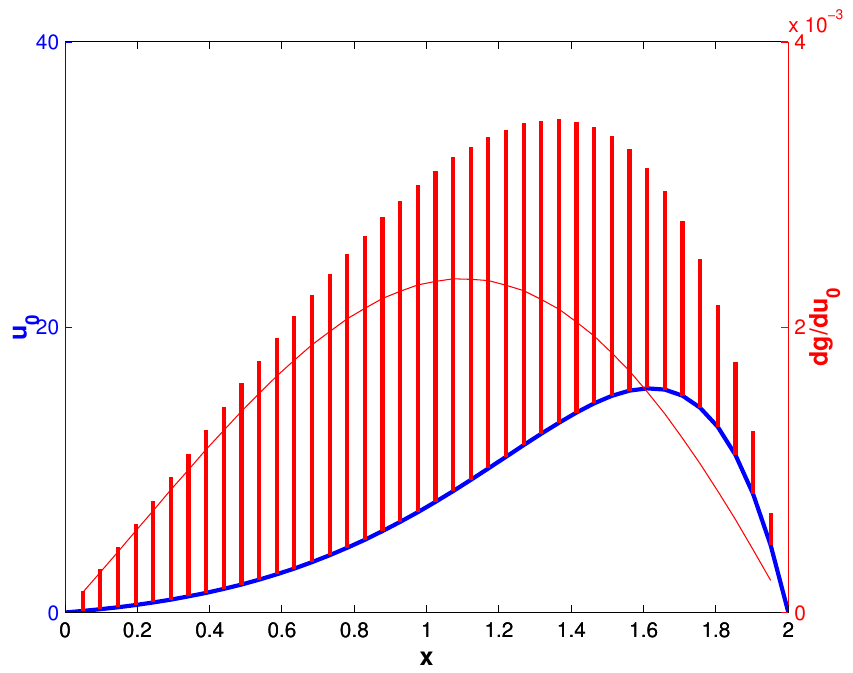

.. role:: math(raw)
   :format: html latex
..

.. _s:adj_examples:

Adjoint sensitivity analysis example problems
=============================================

The next three sections describe in detail a serial example
() and two parallel examples
( and )
that perform adjoint sensitivity analysis. For details on the other
examples, the reader is directed to the comments in their source files.

.. _ss:cvsRoberts_ASAi_dns:

A serial dense example: cvsRoberts_ASAi_dns
-------------------------------------------

As a first example of using for adjoint sensitivity analysis,
we examine the chemical kinetics problem (from )

.. math::

   \label{e:cvsRoberts_ASAi_dns_ODE}
     \begin{split}
       &{\dot y}_1 = -p_1 y_1 + p_2 y_2 y_3   \\
       &{\dot y}_2 =  p_1 y_1 - p_2 y_2 y_3 - p_3 y_2^2 \\
       &{\dot y}_3 =  p_3 y_2^2 \\
       &y(t_0) = y_0 \, ,
     \end{split}

for which we want to compute the gradient with respect to :math:`p` of

.. math::

   \label{e:cvsRoberts_ASAi_dns_G}
     G(p) = \int_{t_0}^{T}  y_3  dt ,

without having to compute the solution sensitivities :math:`{dy}/{dp}`.
Following the derivation in , and taking into account
the fact that the initial values of (`[e:cvsRoberts_ASAi_dns_ODE] <#e:cvsRoberts_ASAi_dns_ODE>`__) do not depend on
the parameters :math:`p`, by (`[e:dGdp] <#e:dGdp>`__) this gradient is simply

.. math::

   \label{e:cvsRoberts_ASAi_dns_dGdp}
   \frac{dG}{dp} = \int_{t_0}^{T} 
   \left( g_p + \lambda^T f_p \right) dt \, ,

where :math:`g(t,y,p) = y_3`, :math:`f` is the vector-valued function
defining the right-hand side of (`[e:cvsRoberts_ASAi_dns_ODE] <#e:cvsRoberts_ASAi_dns_ODE>`__), and :math:`\lambda` is
the solution of the adjoint problem (`[e:adj_eqns] <#e:adj_eqns>`__),

.. math::

   \label{e:cvsRoberts_ASAi_dns_ADJ}
     \begin{split}
       &{\dot\lambda} = - (f_y)^T  \lambda - (g_y)^T \\
       &\lambda(T) = 0 \, .
     \end{split}

In order to avoid saving intermediate :math:`\lambda` values just for the
evaluation of the integral in (`[e:cvsRoberts_ASAi_dns_dGdp] <#e:cvsRoberts_ASAi_dns_dGdp>`__), we extend the
backward problem with the following :math:`N_p` quadrature equations

.. math::

   \label{e:cvsRoberts_ASAi_dns_XI}
     \begin{split}
       &{\dot\xi} = g_p^T + f_p^T \lambda \\
       &\xi (T) = 0 \, ,
     \end{split}

which yield :math:`\xi(t_0) = - \int_{t_0}^{T} ( g_p^T + f_p^T \lambda) dt`
and thus :math:`{dG}/{dp} = -\xi^T(t_0)`.
Similarly, the value of :math:`G` in (`[e:cvsRoberts_ASAi_dns_G] <#e:cvsRoberts_ASAi_dns_G>`__) can be obtained as
:math:`G = - \zeta(t_0)`, where :math:`\zeta` is solution of the following quadrature
equation:

.. math::

   \label{e:cvsRoberts_ASAi_dns_ZETA}
     \begin{split}
       &{\dot\zeta} = g = y_3 \\
       &\zeta(T) = 0 \, .
     \end{split}

The main program and the user-defined routines are described below,
with emphasis on the aspects particular to adjoint sensitivity calculations.

The calling program includes the header files
for definitions and interface function prototypes,
the header file for the definition of the serial implementation
of the module, , the header files
and for the dense
and modules, the header file
for the definition of and ,
and the file for the
definition of the macro.
This program also includes two user-defined accessor macros, and ,
that are useful in writing the problem functions in a form closely matching their
mathematical description, i.e. with components numbered from 1 instead of from 0.
Following that, the program defines problem-specific constants and a user-defined
data structure, which will be used to pass the values of the parameters :math:`p` to various
user routines. The constant defines the number of integration steps
between two consecutive checkpoints.
The program prologue ends with the prototypes of four user-supplied functions that are
called by . The first two provide the right-hand side and dense Jacobian
for the forward problem, and the last two provide the right-hand side and dense
Jacobian for the backward problem.

The function begins with type declarations and continues with the
allocation and initialization of the user data structure, which contains the values
of the parameters :math:`p`. Next, it allocates and
initializes with the initial conditions for the forward problem, allocates and
initializes for the quadrature used in computing the value :math:`G`, and finally
sets the scalar relative tolerance and vector absolute tolerance
for the quadrature variables.
No tolerances for the state variables are defined since
uses its own function to compute the error weights for WRMS norm
estimates of state solution vectors.

The call to creates the main integrator memory block for the
forward integration and specifies the integration method.
The call to initializes the forward integration by specifying the
initial conditions.
The call to specifies a function that computes error weights.
The next call specifies the optional user data pointer .
The linear solver is selected to be through calls to
create the template Jacobian matrix and dense linear solver objects
( and ), and to attach these
to the integrator via the call to
. The user-provided Jacobian routine
is specified through a call to .

The next code block initializes quadrature computations in the forward phase, by
allocating memory for quadrature integration (the call to
specifies the right-hand side of the quadrature
equation and the initial values of the quadrature variable),
setting the integration tolerances for the quadrature variables, and finally
including the quadrature variable in the error test.

Allocation for the memory block of the combined forward-backward
problem is accomplished through the call to which
specifies , the number of steps between two
checkpoints, and specifies cubic Hermite interpolation.

The call to requests the solution of the forward problem to .
If successful, at the end of the integration, will return the number
of saved checkpoints in the argument (optionally, a list of the
checkpoints can be obtained by calling and the
checkpoint information printed).

The next segment of code deals with the setup of the backward problem.
First, a serial vector of length is allocated and initialized with the
value of :math:`\lambda (= 0.0)` at the final time ( = 4.0E7). A second
serial vector of dimension is created and initialized to :math:`0.0`.
This vector corresponds to the quadrature variables :math:`\xi` whose values at :math:`t_0`
will be the components of the desired gradient of :math:`\partial G / \partial p`
(after a sign change).
Following that, the program sets the relative and absolute tolerances
for the backward integration.

The memory for the backward integration is created and allocated
by the calls to the interface routines and which
specify the integration method, among other things. The
dense linear solver is created and initialized by calling the
, and
routines, and specifying a non-
Jacobian routine and user data .

The tolerances for the integration of quadrature variables, and
, are specified through .
The call to indicates that :math:`\xi` should be included
in the error test.
Quadrature computation is initialized by calling
which specifies the right-hand side of the quadrature equations as .

The actual solution of the backward problem is accomplished through
two calls to — one for intermediate output at :math:`t = 40`,
and one for the final time :math:`= 0`. At each point, the backward
solution (:math:`= \lambda`) is obtained with a call to and the
forward solution with a call to . The values of the
quadrature variables :math:`\xi` at time are loaded in by calling
the extraction routine . The negative of
gives the gradient :math:`\partial G / \partial p`.

The main program then carries out a second backward problem.
It calls to and to re-initialize the
backward memory block for a new adjoint computation with a different final
time ( :math:`= 50`). This is followed by two calls to ,
one for intermediate output at :math:`t = 40` and one for the final values at
:math:`t = 0`. Finally, the gradient :math:`\partial G / \partial p` of the second
function :math:`G` is printed.

The main program ends by freeing previously allocated memory by calling
(for the memory for the forward problem),
(for the memory allocated for the combined problem), and
(for the various vectors).

The user-supplied functions and for the right-hand side and
Jacobian of the forward problem are straightforward expressions of its
mathematical formulation (`[e:cvsRoberts_ASAi_dns_ODE] <#e:cvsRoberts_ASAi_dns_ODE>`__).
The function is the same as the one for .
The function implements
(`[e:cvsRoberts_ASAi_dns_ZETA] <#e:cvsRoberts_ASAi_dns_ZETA>`__), while , , and are mere
translations of the backward problem (`[e:cvsRoberts_ASAi_dns_ADJ] <#e:cvsRoberts_ASAi_dns_ADJ>`__) and
(`[e:cvsRoberts_ASAi_dns_XI] <#e:cvsRoberts_ASAi_dns_XI>`__).

The output generated by is shown below.

.. literalinclude:: ../../../../examples/cvodes/serial/cvsRoberts_ASAi_dns.out
   :language: none

.. _ss:cvsAdvDiff_ASAp_non_p:

A parallel nonstiff example: cvsAdvDiff_ASAp_non_p
--------------------------------------------------

As an example of using the adjoint sensitivity module with the
parallel vector module , we describe a sample program that solves
the following problem: Consider the 1-D advection-diffusion equation

.. math::

   \label{e:cvsAdvDiff_ASAp_non_p:orig_pde}
     \begin{split}
       & \frac{\partial u}{\partial t} = p_1 \frac{\partial^2 u}{\partial x^2} 
       + p_2 \frac{\partial u}{\partial x} \\
       & 0 = x_0 \le x \le x_1 = 2 \\
       & 0 = t_0 \le t \le t_f = 2.5 \, ,
     \end{split}

with boundary conditions :math:`u(t,x_0) = u(t,x_1) = 0 ,\, \forall t`,
and initial condition :math:`u(t_0 , x) = u_0(x) = x(2-x)e^{2x}`. Also
consider the function

.. math:: g(t) = \int_{x_0}^{x_1} u(t,x) dx \, .

We wish to find, through adjoint sensitivity analysis, the gradient of
:math:`g(t_f)` with respect to :math:`p = [p_1 ; p_2]` and the perturbation in :math:`g(t_f)`
due to a perturbation :math:`\delta u_0` in :math:`u_0`.

The approach we take in the program is to first derive an
adjoint PDE which is then discretized in space and integrated backwards
in time to yield the desired sensitivities. A straightforward extension
to PDEs of the derivation given in gives

.. math::

   \label{e:cvsAdvDiff_ASAp_non_p:dgdp}
     \frac{dg}{dp} (t_f) = \int_{t_0}^{t_f} dt 
     \int_{x_0}^{x_1} dx \mu \cdot 
     \left[
       \frac{\partial^2 u}{\partial x^2} ;
       \frac{\partial u}{\partial x}
     \right ]

and

.. math::

   \label{e:cvsAdvDiff_ASAp_non_p:delg}
     \delta g |_{t_f} = \int_{x_0}^{x_1} \mu(t_0,x) \delta u_0(x) dx \, ,

where :math:`\mu` is the solution of the adjoint PDE

.. math::

   \label{e:cvsAdvDiff_ASAp_non_p:adj_pde}
     \begin{split}
       & \frac{\partial \mu}{\partial t} + p_1 \frac{\partial^2 \mu}{\partial x^2} 
       - p_2 \frac{\partial \mu}{\partial x} = 0 \\
       & \mu(t_f , x) = 1 \\
       & \mu(t , x_0) = \mu( t , x_1 ) = 0 \, .
     \end{split}

Both the forward problem (`[e:cvsAdvDiff_ASAp_non_p:orig_pde] <#e:cvsAdvDiff_ASAp_non_p:orig_pde>`__) and the backward
problem (`[e:cvsAdvDiff_ASAp_non_p:adj_pde] <#e:cvsAdvDiff_ASAp_non_p:adj_pde>`__) are discretized on a uniform spatial
grid of size :math:`M_x + 2` with central differencing and with boundary values eliminated,
leaving ODE systems of size :math:`N = M_x` each. As always, we deal with the time
quadratures in (`[e:cvsAdvDiff_ASAp_non_p:dgdp] <#e:cvsAdvDiff_ASAp_non_p:dgdp>`__) by introducing the additional
equations

.. math::

   \label{e:cvsAdvDiff_ASAp_non_p:quad}
     \begin{split}
       &{\dot\xi}_1 = \int_{x_0}^{x_1} dx \mu \frac{\partial^2 u}{\partial x^2} \, , \quad
       \xi_1(t_f) = 0 \, , \\
       &{\dot\xi}_2 = \int_{x_0}^{x_1} dx \mu \frac{\partial u}{\partial x} \, , \quad
       \xi_2(t_f) = 0 \, ,
     \end{split}

yielding

.. math:: \frac{dg}{dp} (t_f) = - \left[ \xi_1(t_0) ; \xi_2(t_0) \right ]

The space integrals in (`[e:cvsAdvDiff_ASAp_non_p:delg] <#e:cvsAdvDiff_ASAp_non_p:delg>`__) and
(`[e:cvsAdvDiff_ASAp_non_p:quad] <#e:cvsAdvDiff_ASAp_non_p:quad>`__) are
evaluated numerically, on the given spatial mesh, using the trapezoidal rule.

Note that :math:`\mu(t_0 , x^*)` is nothing but the perturbation in :math:`g(t_f)`
due to a :math:`\delta`-function perturbation :math:`\delta u_0(x) = \delta(x-x^*)` in the
initial conditions. Therefore, :math:`\mu(t_0,x)` completely describes :math:`\delta g(t_f)`
for any perturbation :math:`\delta u_0`.

Both the forward and the backward problems are solved with the option for nonstiff systems,
i.e. using the Adams method with fixed-point iteration for the solution of
the nonlinear systems. The overall structure of the function is very
similar to that of the code discussed previously with
differences arising from the use of the parallel module. Unlike
, the example illustrates
computation of the additional quadrature variables by appending equations
to the adjoint system. This approach can be a better alternative to using special
treatment of the quadrature equations when their number is too small for parallel
treatment.

Besides the parallelism implemented by at the level,
this example uses calls to parallelize the calculations of the
right-hand side routines and and of the spatial integrals involved.
The forward problem has size , while the backward problem has
size , where is the number of quadrature equations
in (`[e:cvsAdvDiff_ASAp_non_p:quad] <#e:cvsAdvDiff_ASAp_non_p:quad>`__).
The use of the total number of available processes on two problems of different
sizes deserves some comments, as this is typical in adjoint sensitivity
analysis. Out of the total number of available processes, namely ,
the first processes are dedicated to the integration of
the ODEs arising from the semi-discretization of the PDEs
(`[e:cvsAdvDiff_ASAp_non_p:orig_pde] <#e:cvsAdvDiff_ASAp_non_p:orig_pde>`__) and (`[e:cvsAdvDiff_ASAp_non_p:adj_pde] <#e:cvsAdvDiff_ASAp_non_p:adj_pde>`__),
and receive the same load on both the forward and backward integration phases.
The last process is reserved for the integration of the quadrature equations
(`[e:cvsAdvDiff_ASAp_non_p:quad] <#e:cvsAdvDiff_ASAp_non_p:quad>`__), and is therefore inactive during the forward
phase. Of course, for problems involving a much larger number of quadrature equations,
more than one process could be reserved for their integration.
An alternative would be to redistribute the backward problem variables
over all available processes, without any relationship to the load distribution
of the forward phase. However, the approach taken in
has the advantage that the communication strategy adopted for the forward problem
can be directly transferred to communication among the first
processes during the backward integration phase.

We must also emphasize that, although inactive during the forward integration phase,
the last process *must* participate in that phase with a
*zero local array length*.
This is because, during the backward integration phase, this process must
have its own local copy of variables (such as ) that were set
only during the forward phase.

Using :math:`=40` on 4 processes, the gradient of :math:`g(t_f)` with respect to
the two problem parameters is obtained as :math:`dg/dp(t_f) = [ -1.13856; -1.01023]`.
The gradient of :math:`g(t_f)` with respect to the initial conditions is shown in
Fig. \ `[f:cvsAdvDiff_ASAp_non_p] <#f:cvsAdvDiff_ASAp_non_p>`__. The gradient is plotted superimposed over the
initial conditions.

   The gradient of :math:`g(t_f)` with respect to the initial conditions :math:`u_0`
   is shown superimposed over the values :math:`u_0`.

[f:cvsAdvDiff_ASAp_non_p]

Sample output generated by , for :math:`=20`, is
shown below.

.. literalinclude:: ../../../../examples/cvodes/parallel/cvsAdvDiff_ASAp_non_p.out
   :language: none

.. _ss:cvsAtmDisp_ASAi_kry_bbd_p:

A parallel example using CVBBDPRE: cvsAtmDisp_ASAi_kry_bbd_p
------------------------------------------------------------

As a more elaborate example of a parallel adjoint sensitivity calculation,
we describe next the program provided
with . This example models an atmospheric
release with an advection-diffusion PDE in 2-D or 3-D and computes the gradient
with respect to source parameters of the space-time average of the squared norm
of the concentration.
Given a known velocity field :math:`v(t,x)` and source function :math:`S`, the transport
equation for the concentration :math:`c(t,x)` in a domain :math:`\Omega` is given by

.. math::

   \label{e:cvsAtmDisp_ASAi_kry_bbd_p_PDE}
     \begin{split}
       \frac{\partial c}{\partial t} - k \nabla^2 c + v \cdot \nabla c + S = 0 \, , 
       &\text{ in } (0,T) \times \Omega \\
       \frac{\partial c}{\partial n} = g \, ,
       &\text{ on } (0,T) \times \partial\Omega \\
       c = c_0(x) \, ,
       &\text{ in } \Omega \text{ at } t = 0 \, ,
     \end{split}

where :math:`\Omega` is a box in :math:`{\mathbb{R}}^2` or :math:`{\mathbb{R}}^3` and :math:`n` is the
normal to the boundary of :math:`\Omega`.
We assume homogeneous boundary conditions (:math:`g = 0`) and a zero initial
concentration everywhere in :math:`\Omega` (:math:`c_0(x) = 0`). The wind field has only a
nonzero component in the :math:`x` direction given by a Poiseuille profile along the
direction :math:`y`.

Using adjoint sensitivity analysis, the gradient of

.. math::

   \label{e:cvsAtmDisp_ASAi_kry_bbd_p_G}
     G(p) = \frac{1}{2} \int_0^T \int_\Omega \| c(t,x) \|^2 \, d\Omega \, dt

is obtained as

.. math::

   \label{e:cvsAtmDisp_ASAi_kry_bbd_p_dGdp}
     \frac{dG}{dp_i} = \int_t \int_\Omega \lambda(t,x) \delta(x-x_i) \, d\Omega \, dt
     = \int_t \lambda(t,x_i) \, dt \, ,

where :math:`x_i` is the location of the source of intensity :math:`S(x_i)=p_i`, and :math:`\lambda`
is solution of the adjoint PDE

.. math::

   \label{e:cvsAtmDisp_ASAi_kry_bbd_p_ADJ}
     \begin{split}
       - \frac{\partial\lambda}{\partial t} - k \nabla^2\lambda - v \cdot \lambda = c(t,x)  \, ,
       &\text{ in } (T,0) \times \Omega \\
       (k \nabla\lambda + v \lambda) \cdot n = 0 \, ,
       &\text{ on } (0,T) \times \partial\Omega \\
       \lambda = 0 \, ,
       &\text{ in } \Omega \text{ at } t = T \, .
     \end{split}

The PDE (`[e:cvsAtmDisp_ASAi_kry_bbd_p_PDE] <#e:cvsAtmDisp_ASAi_kry_bbd_p_PDE>`__) is semi-discretized in space with
central finite differences, with the boundary conditions explicitly taken into account
by using layers of ghost cells in every direction. If the direction :math:`x^i` of :math:`\Omega`
is discretized into :math:`m_i` intervals, this leads to a system of ODEs of dimension
:math:`N = \prod_1^d (m_i+1)`, with :math:`d=2`, or :math:`d=3`.
The source term :math:`S` is parameterized as a piecewise constant function and yielding
:math:`N` parameters in the problem. The nominal values of the source parameters correspond
to two Gaussian sources.

The source code as supplied runs the 2-D problem. To obtain the 3-D version,
add a line at the top of .

The adjoint PDE (`[e:cvsAtmDisp_ASAi_kry_bbd_p_ADJ] <#e:cvsAtmDisp_ASAi_kry_bbd_p_ADJ>`__) is discretized to a system of
ODEs in a similar fashion. The space integrals in (`[e:cvsAtmDisp_ASAi_kry_bbd_p_G] <#e:cvsAtmDisp_ASAi_kry_bbd_p_G>`__)
and (`[e:cvsAtmDisp_ASAi_kry_bbd_p_dGdp] <#e:cvsAtmDisp_ASAi_kry_bbd_p_dGdp>`__) are simply approximated by their
Riemann sums, while the time integrals are resolved by appending pure quadrature
equations to the systems of ODEs.

We use BDF with the linear solver module and the
preconditioner for both the forward and the backward
integration phases. The value of :math:`G` is computed on the forward phase
as a quadrature, while the components of the gradient :math:`dG/dp` are
computed as quadratures during the backward integration phase. All
quadrature variables are included in the corresponding error tests.

Communication between processes for the evaluation of the ODE right-hand sides involves
passing the solution on the local boundaries (lines in 2-D, surfaces in 3-D) to
the 4 (6 in 3-D) neighboring processes. This is implemented in the function
, called in and before evaluation of the local residual
components. Since there is no additional communication required for the
preconditioner, a pointer is passed for and in the
calls to and , respectively.

For the sake of clarity, the example does not use
the most memory-efficient implementation possible, as the local segment of the
solution vectors ( on the forward phase and on the backward phase)
and the data received from neighboring processes is loaded into a temporary
array which is then used exclusively in computing the local components
of the right-hand sides.

Note that if is given any command line argument,
it will generate a series of MATLAB files which can be used to visualize the solution.
The results of a 2-D simulation and adjoint sensitivity analysis with
on a :math:`80 \times 80` grid and :math:`2 \times 4 = 8`
processes are shown in Fig. \ `[f:cvsAtmDisp_ASAi_kry_bbd_p2D] <#f:cvsAtmDisp_ASAi_kry_bbd_p2D>`__.
Results in 3-D [1]_, on a :math:`80 \times 80 \times 40` grid and
:math:`2 \times 4 \times 2= 16` processes are shown in
Figs. \ `[f:cvsAtmDisp_ASAi_kry_bbd_p3D_a] <#f:cvsAtmDisp_ASAi_kry_bbd_p3D_a>`__ and `[f:cvsAtmDisp_ASAi_kry_bbd_p3D_b] <#f:cvsAtmDisp_ASAi_kry_bbd_p3D_b>`__.

.. figure:: ../../../../doc/cvodes/cvsadjkryx_p2D.pdf
   :alt: Results for the example problem in 2D.
   :width: 100%

   The gradient with respect to the source parameters is pictured on the left.
   On the right, the gradient was color-coded and superimposed over the nominal value
   of the source parameters.

[f:cvsAtmDisp_ASAi_kry_bbd_p2D]

.. figure:: ../../../../doc/cvodes/cvsadjkryx_p3Dcf.png
   :alt: Results for the example problem in 3D.
   :width: 100%

   Nominal values of the source parameters.

[f:cvsAtmDisp_ASAi_kry_bbd_p3D_a]

.. figure:: ../../../../doc/cvodes/cvsadjkryx_p3Dgrad.png
   :alt: Results for the example problem in 3D.
   :width: 100%

   Two isosurfaces of the gradient with respect to the source parameters. They correspond
   to values of :math:`0.25` (green) and :math:`0.4` (blue).

[f:cvsAtmDisp_ASAi_kry_bbd_p3D_b]

A sample output generated by for a 2D calculation
is shown below.

.. raw:: latex

   .. literalinclude:: ../../../../examples/cvodes/parallel/cvsAtmDisp_ASAi_kry_bbd_p.out
   :language: none

.. [1]
   The name of the executable for the 3-D version is
   .
