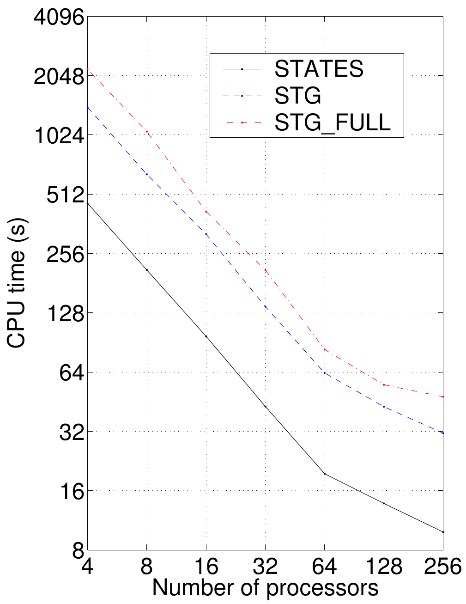

.. role:: math(raw)
   :format: html latex
..

.. role:: raw-latex(raw)
   :format: latex
..

.. _s:ex_tests:

Parallel tests
==============

The most preeminent advantage of over existing sensitivity solvers is
the possibility of solving very large-scale problems on massively parallel
computers. To illustrate this point we present speedup results for the
integration and forward sensitivity analysis for
an ODE system generated from the following 2-species diurnal
kinetics advection-diffusion PDE system in 2 space dimensions.
This work was reported in [SeHi:05].
The PDE is a modification of that described in [Wit:96], and takes the form:

.. math::

   \frac{dc_i}{dt} = K_h \frac{d^2c_i}{dx^2} + v \frac{dc_i}{dx} 
     + K_v \frac{d^2c_i}{dz^2}
     + R_i(c_1, c_2, t) \, , \quad \text{for } i=1,2 \, ,

where

.. math::

   \begin{split}
       R_1(c_1,c_2,t) &= -q_1 c_1 c_3 - q_2 c_1 c_2 + 2 q_3(t) c_3 + q_4(t) c_2 , \\
       R_2(c_1,c_2,t) &=  q_1 c_1 c_3 - q_2 c_1 c_2 - q_4(t) c_2 \, ,
     \end{split}

:math:`K_h`, :math:`K_v`, :math:`v`, :math:`q_1`, :math:`q_2`, and :math:`c_3` are constants, and :math:`q_3(t)` and :math:`q_4(t)`
vary diurnally.
The problem is posed on the square
:math:`0 \le x \le 20`, :math:`30 \le z \le 50` (all in km),
with homogeneous Neumann boundary conditions, and for time t in
:math:`0 \le t \le 86400` (1 day).
The PDE system is treated by central differences on a uniform
mesh, except for the advection term, which is treated with a biased
3-point difference formula.
The initial profiles are proportional to a simple polynomial in :math:`x`
and a hyperbolic tangent function in :math:`z`.

The solution with is done with the BDF/GMRES method (i.e.
using the linear solver module) and the block-diagonal part of the
Newton matrix as a left preconditioner. A copy of the block-diagonal
part of the Jacobian is saved and conditionally reused within the
preconditioner setup function.

The problem is solved by using :math:`P` processes, treated as a
rectangular process grid of size :math:`p_x \times p_z`.
Each process is assigned a subgrid of size :math:`n = n_x \times n_z` of the
:math:`(x,z)` mesh. Thus the actual mesh size is
:math:`N_x \times N_z = (p_x n_x) \times (p_z n_z)`,
and the ODE system size is :math:`N = 2 N_x N_z`.
Parallel performance tests were performed on ASCI Frost, a 68-node, 16-way SMP system
with POWER3 375 MHz processors and 16 GB of memory per node.
We present timing results for the integration of only the state equations
(column STATES), as well as for
the computation of forward sensitivities with respect to the diffusion coefficients
:math:`K_h` and :math:`K_v` using the staggered corrector method without and with
error control on the sensitivity variables (columns STG and
STG_FULL, respectively).
Run times for a global problem size of
:math:`N = 2 N_x N_y = 2 \cdot 1600 \cdot 400 = 1,280,000`
are shown in Fig. \ `[f:pvfktTest] <#f:pvfktTest>`__ and listed below.

+-----------+--------+---------+----------+
| :math:`P` | STATES | STG     | STG_FULL |
+===========+========+=========+==========+
| 4         | 460.31 | 1414.53 | 2208.14  |
+-----------+--------+---------+----------+
| 8         | 211.20 | 646.59  | 1064.94  |
+-----------+--------+---------+----------+
| 16        | 97.16  | 320.78  | 417.95   |
+-----------+--------+---------+----------+
| 32        | 42.78  | 137.51  | 210.84   |
+-----------+--------+---------+----------+
| 64        | 19.50  | 63.34   | 83.24    |
+-----------+--------+---------+----------+
| 128       | 13.78  | 42.71   | 55.17    |
+-----------+--------+---------+----------+
| 256       | 9.87   | 31.33   | 47.95    |
+-----------+--------+---------+----------+

We note that there was not enough memory to solve the problem (even without
carrying sensitivities) using fewer processes.

The departure from the ideal line of slope :math:`-1` is explained by the
interplay of several conflicting processes. On one hand, when increasing the
number of processes, the preconditioner quality decreases, as it incorporates
a smaller and smaller fraction of the Jacobian, and the cost of interprocess
communication increases. On the other hand, decreasing the number of processes
leads to an increase in the cost of the preconditioner setup phase and to a larger
local problem size which can lead to a point where a node starts memory-paging
to disk.

   Speedup results for the integration of the state equations only
   (solid line), staggered sensitivity analysis without
   error control on the sensitivity variables (dashed line),
   and staggered sensitivity analysis with full error control (dotted line)
